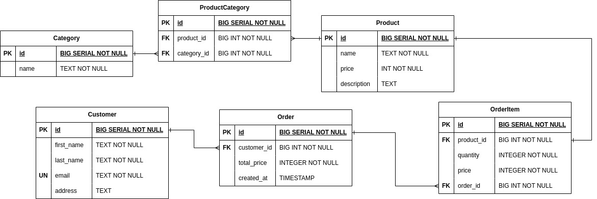

# Spring Boot and Spring Data JPA

## Introduction

Welcome to the repository for the code examples associated with my article on Spring Boot and Spring Data JPA. This repository contains the source code, configuration files, and any additional resources discussed in the article.

You can see the design table [here](./assets/spring-jpa-design). Open it with [draw.io](https://draw.io) application.

## Installation

+ Install the dependencies in `pom.xml` file.
+ `PostgreSQL` on your local machine.

## Usage

+ In `application.properties`, set and use your own database name, username and password

## Part 1

In part 1, models and design of the database table is discussed. You can see the implementations
in `model` package.
